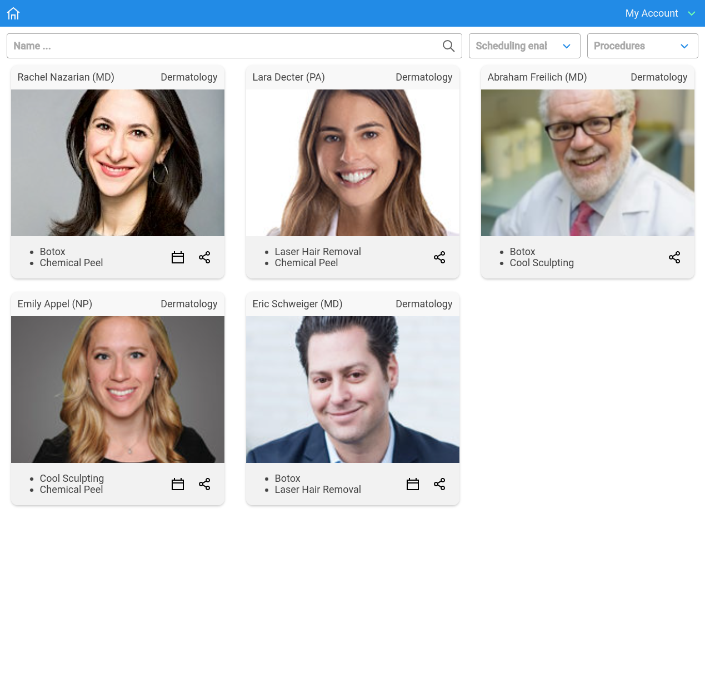

# My Doctors List

## What is My Doctors List

It's a next generation search and appointment management ("comming soon...") platform for you next customer, find the ones that need what you offer, with this simple and painless tool.

## How to use the App

Load the app, apply any filters you want, filters are on top, enjoy:

## Development Doc

In the project directory, you can run:

### `npm start`

It starts the server on http://localhost:3000

### `npm test`

Executes the test suite

### `npm run build`

Generates a production build

## What's next

Some nice to haves:

* Appointment management feature
* Better description of the procedures maybe with a catalog or something like that
* User management (probably)
* A way for registered doctors to post what supplies they need, like an internal marketplace?

